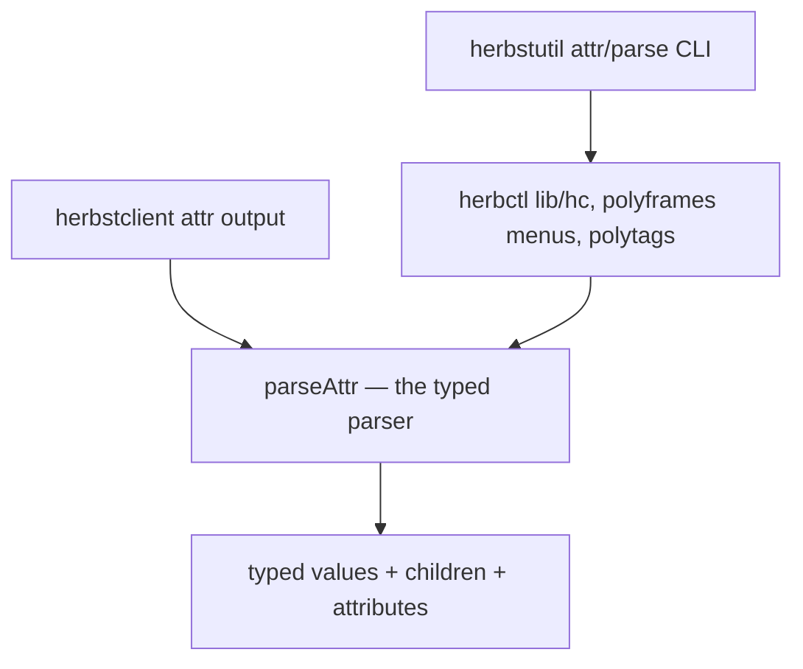
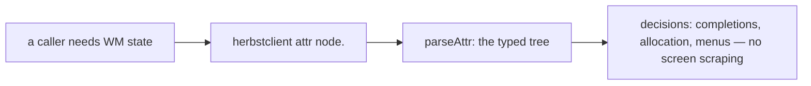

# herbstutil — structural + logical

## structural

```mermaid
graph TD
    HC[herbstclient attr output] --> PARSE[parseAttr — the typed parser]
    PARSE --> JSON[typed values + children + attributes]
    CONSUMERS[herbctl lib/hc, polyframes menus, polytags] --> PARSE
    CLI[herbstutil attr/parse CLI] --> CONSUMERS
```

## logical

```mermaid
flowchart LR
    Q[a caller needs WM state] --> A[herbstclient attr node.]
    A --> P[parseAttr: the typed tree]
    P --> D[decisions: completions, allocation, menus — no screen scraping]
```
